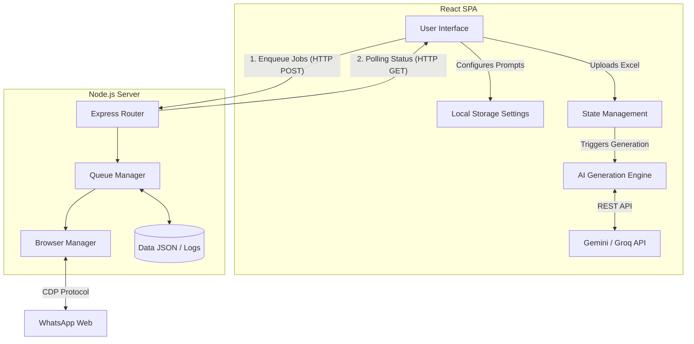
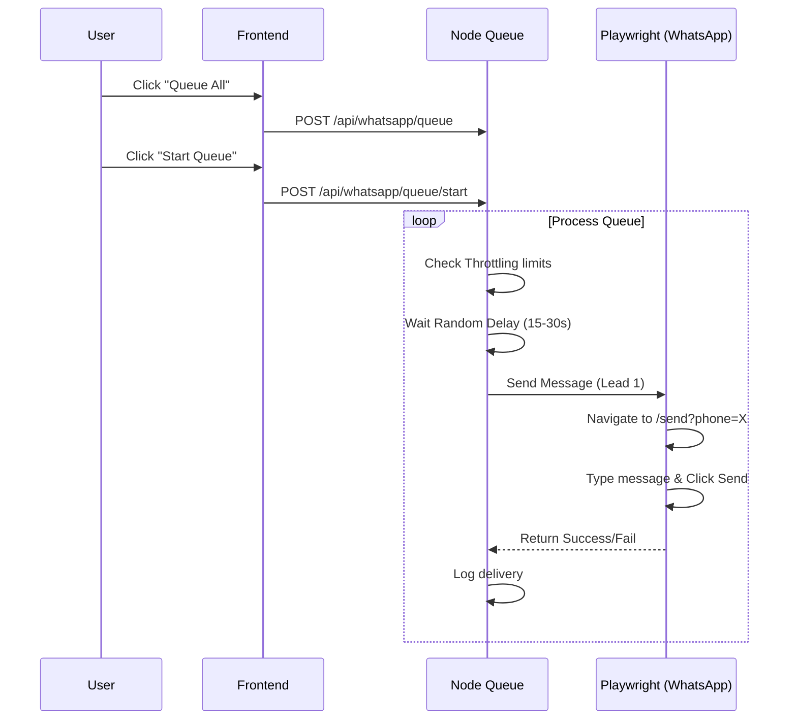

# Lead Message Generator & WhatsApp Automation

An end-to-end AI-powered pipeline that ingests lead data from Excel, dynamically generates highly personalized outreach messages using Google Gemini or Groq, and automates delivery via WhatsApp Web using a persistent Playwright browser instance.

---

##  Features

- **Excel Data Ingestion**: Upload `.xlsx` or `.csv` files and dynamically map columns to required fields (Business Name, Phone, Contact Name, Context).
- **AI Personalization Engine**: Connects to Gemini/Groq to generate messages based on customizable tones, lengths, languages, and CTA types.
- **WhatsApp Web Automation**: Uses a headless (or visible) Playwright Chromium instance to securely hook into WhatsApp Web and send messages automatically.
- **Smart Throttling & Rate Limiting**: Built-in human-like typing delays and batch pausing to prevent spam-blocking algorithms.
- **Persistent State**: Retains WhatsApp authentication sessions, frontend settings, and a duplicate-prevention delivery log.

---

##  High-Level Design (HLD)

The architecture is split into a React Frontend (SPA) for the user interface and AI generation logic, and a Node.js/Express Backend for managing the WhatsApp Playwright instance.



---

##  Low-Level Design (LLD)

### 1. Frontend Architecture
The frontend is built with **React 19** and **Vite**, utilizing custom hooks for state isolation.
- **`useExcel.js`**: Handles file parsing using `xlsx` and manages column mappings.
- **`useSettings.js`**: Persists AI keys, tones, and selected models to `localStorage`.
- **`useBatchGeneration.js`**: Orchestrates the rate-limited requests to the AI providers. It acts as a client-side queue for AI generation to prevent hitting rate limits on Groq/Gemini.
- **`prompt/builder.js`**: A dynamic compiler that injects the user's settings (Tone, Language) into a master system prompt.

### 2. Backend Architecture (`/whatsapp-server`)
The backend is a **Node.js/Express** server orchestrating a Playwright queue.
- **`queueProcessor.js`**: A persistent loop that monitors `queueManager.js`. It tracks batch sizes and handles randomized `minDelaySec` and `maxDelaySec` between dispatches.
- **`whatsappClient.js`**: The direct interface to Playwright. It manages checking selectors (QR Code, Chat List, Send Buttons). It catches `INVALID_NUMBER_DIALOG` to gracefully skip unregistered numbers.
- **`settingsManager.js`**: Saves backend throttling limits to disk so they persist across server restarts.
- **`deliveryLogger.js`**: Appends sent results to `delivery-log.jsonl` to ensure the system strictly never messages the same lead twice.



---

## 💻 Setup & Installation

### Prerequisites
- **Node.js**: v20 or higher (Required for frontend dependencies and Playwright).
- **Google Gemini API Key** or **Groq API Key**.

### 1. Clone & Install
Open two terminal windows (one for the frontend, one for the backend).

**Frontend:**
```bash
# In the root directory
npm install
```

**Backend:**
```bash
cd whatsapp-server
npm install

# Download the required browser binaries for automation
npx playwright install chromium
```

### 2. Environment Variables
Create a `.env` file in the root directory:
```env
# AI Providers
VITE_GEMINI_BASE_URL=https://generativelanguage.googleapis.com
VITE_GROQ_BASE_URL=https://api.groq.com/openai/v1

# WhatsApp Automation Server
VITE_WHATSAPP_API_URL=http://localhost:3001/api/whatsapp

# Backend Defaults
WHATSAPP_DEFAULT_COUNTRY=IN
WHATSAPP_TEST_MODE=true
```

> **Note on Test Mode**: While `WHATSAPP_TEST_MODE=true`, the bot will type messages into the WhatsApp chat box but **will not click send**. Change this to `false` when you are ready for live production sending.

### 3. Run the Servers

**Terminal 1 (Frontend):**
```bash
npm run dev
```
*(Runs on http://localhost:5173)*

**Terminal 2 (Backend):**
```bash
cd whatsapp-server
npm run dev
```
*(Runs on http://localhost:3001)*

---

## 📖 Usage Workflow

1. **Configure AI**: Go to the **Settings** tab on the frontend. Add your Gemini/Groq API keys.
2. **Authenticate WhatsApp**: Open the **WhatsApp** tab. Check the server terminal, a Chromium window will be running. Scan the QR code with your phone. The dashboard will show "Authenticated".
3. **Upload Data**: Go to the **Upload** tab. Upload an Excel sheet containing Business Names and Phone numbers.
4. **Generate Messages**: Go to the **Generate** tab. Select your desired Tone, Language, and Call to Action. Click "Start".
5. **Queue for Delivery**: Review the generated messages in the table. Click "Queue All".
6. **Start Outreach**: Go back to the **WhatsApp** tab. Adjust your Throttling settings (Batch size, Delays) and click **Start Queue**.

---

## 🛠️ Troubleshooting

- **Queue is stuck on Pending**: Ensure the Node backend is running and the Playwright window is authenticated. If the window is closed, restart the backend server.
- **"Invalid Phone Number" errors**: Ensure the Excel sheet contains phone numbers. The system uses `libphonenumber-js` and defaults to India (`IN` / `+91`) if country codes are missing. You can change this in the `.env` file.
- **Browser crashing on startup**: Ensure you have run `npx playwright install chromium` inside the `whatsapp-server` folder.

---

##  Production Readiness & Crash Recovery

This system is built with safeguards for real-world production environments where network drops or browser crashes are expected.

### Crash Recovery
If your computer dies, the Node server crashes, or the Playwright browser is force-closed mid-send, the current lead being processed remains marked as `SENDING` in the queue database. 
- **Self-Healing**: The next time you click **Start Queue**, the backend automatically scans for any jobs stuck in `SENDING` and safely resets them to `RETRY_PENDING`. No leads are lost.

### Duplicate Prevention (`ALREADY_SENT`)
- Every time a message successfully sends, it writes an immutable record to `whatsapp-server/data/delivery-log.jsonl`.
- Before the sender even opens a WhatsApp chat for a new job, it scans this delivery log. If it finds the `leadId` has already successfully received a message in the past, it aborts the send and marks the job as `ALREADY_SENT`.
- This ensures you never accidentally double-message a lead, even if you re-upload the same Excel sheet weeks later.

### ⚠️ Pre-Flight Checklist for Live Production

Before you switch off Test Mode and run a real campaign, follow these rules:

1. **Disable Test Mode**: Change `WHATSAPP_TEST_MODE=true` to `false` in your `.env` file and restart the backend server.
2. **Use a Dedicated Number**: Never use your personal WhatsApp number for automated cold outreach. If your throttling limits are too aggressive and WhatsApp flags the account, it will be banned. Purchase a separate SIM dedicated strictly to this automation engine.
3. **Warm Up the Account**: Do not start by sending 100 messages on day one. For the first week, use the UI Throttling Settings to send very small batches (e.g., 5-10 messages a day) with long random delays. Once WhatsApp's algorithms establish trust with the new number, you can slowly scale up your batch limits.
